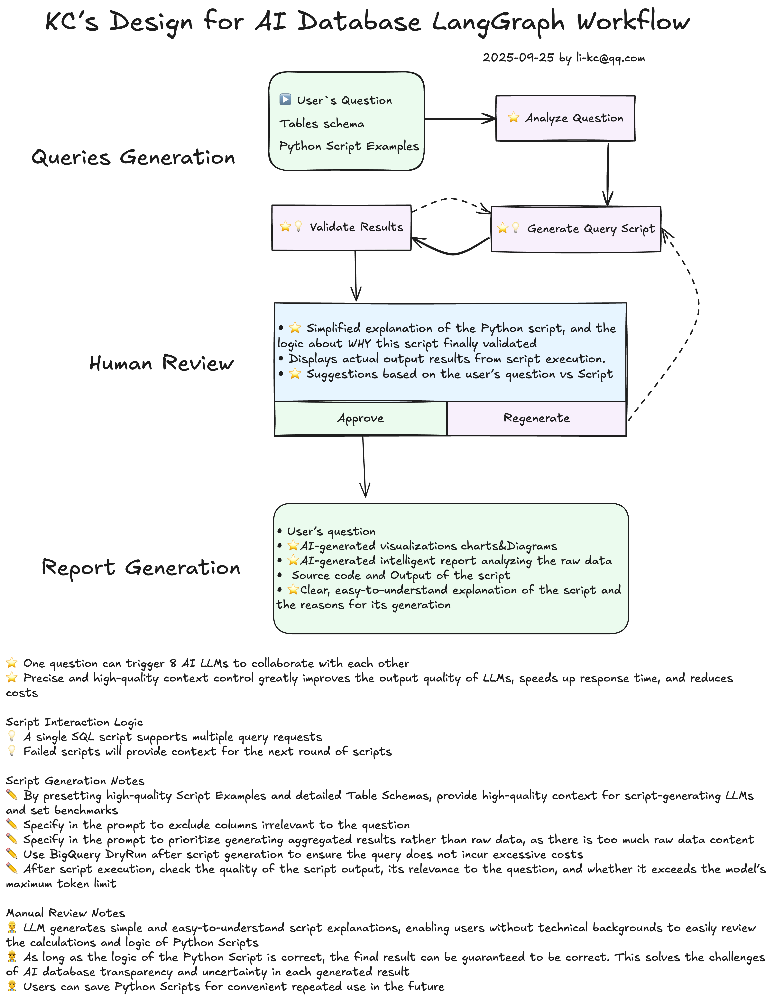

# AI Database Analyst - LangGraph Workflow

This repository contains an AI Database Analyst project built with LangGraph. The project is designed to understand natural language questions from users, automatically generate and execute SQL queries, validate and visualize the results, and support a human review process to produce a comprehensive analysis report.




## Core Features

- **Natural Language Understanding**: Utilizes semantic matching to comprehend user questions and map them to predefined query templates or analytical intents.
- **Dynamic Query Generation**: Dynamically constructs complex SQL query plans based on Large Language Models (LLMs) and multi-step reasoning.
- **Safe Execution**: Performs a "Dry Run" check before executing queries to estimate costs and impact, ensuring the safety of database operations.
- **Automated Result Validation**: Automatically validates query results for data consistency, completeness, and logical correctness.
- **Interactive Human Review**: Pauses the workflow at critical steps to allow users to review, modify, or approve queries and results.
- **Intelligent Visualization**: Automatically generates charts (e.g., tables, bar charts, line charts) and analysis reports based on query results and user preferences.
- **End-to-End Monitoring**: Integrates with LangSmith for complete, end-to-end tracking, performance monitoring, and cost analysis of the workflow.
- **Robust Error Handling**: Features built-in retry, circuit breaker, and recovery mechanisms to gracefully handle exceptions like query errors and API timeouts.

## Tech Stack

- **Core Framework**: [LangGraph](https://github.com/langchain-ai/langgraph) - For building stateful, multi-agent workflows.
- **Large Language Model (LLM)**: Google Gemini Pro (via Vertex AI)
- **Database**: Google BigQuery
- **Monitoring & Debugging**: [LangSmith](https://www.langchain.com/langsmith)
- **Python Libraries**: `langchain`, `structlog`, `dotenv`, `pandas`, etc.

## Project Structure

```
.
├── flows/                  # Sub-workflow modules
│   ├── semantic_matching_flow.py   # Semantic Matching
│   ├── chief_architect_flow.py     # Query Generation
│   ├── dry_run_safety.py           # Safe Execution
│   ├── script_validation_flow.py   # Result Validation
│   ├── human_review_flow.py        # Human Review
│   └── visualization_flow.py       # Visualization
├── config/                 # Configuration files
│   ├── langsmith_config.py         # LangSmith config
│   └── prompt_templates.py         # Prompt templates
├── monitoring/             # Monitoring and tracing modules
├── error_handling/         # Error handling modules
├── tools/                  # Tools for BigQuery, visualization, etc.
├── webui/                  # (Optional) Streamlit Web UI
├── main_workflow.py        # Main workflow entry point
├── requirements.txt        # Python dependencies
└── README.md               # Project documentation (Chinese)
└── README.en.md            # Project documentation (English)
```

## Installation and Setup

1.  **Clone the Repository**
    ```bash
    git clone <your-repo-url>
    cd <your-repo-name>
    ```

2.  **Create and Activate a Virtual Environment**
    ```bash
    python -m venv venv
    source venv/bin/activate
    ```

3.  **Install Dependencies**
    ```bash
    pip install -r requirements.txt
    ```

4.  **Configure Environment Variables**
    Copy `.env.example` to a new file named `.env` and fill in your Google Cloud, BigQuery, and LangSmith API keys.
    ```bash
    cp .env.example .env
    # Edit the .env file
    ```

5.  **Start LangGraph Studio**
    The project is developed and debugged using LangGraph Studio.
    ```bash
    langgraph dev
    ```
    After starting, you can access `http://localhost:port` to interact with the AI Database Analyst.

## BigQuery Integration and Validation

The project connects to BigQuery using Google Cloud's standard authentication flow. Here are the detailed steps for configuration and validation.

### 1. Authentication Method

This application uses **Application Default Credentials (ADC)** for authentication. This means you can provide credentials in one of the following ways:

- **gcloud CLI (Recommended)**: Authenticate in your local development environment using the `gcloud` tool.
  ```bash
  gcloud auth application-default login
  ```
  After running this command, your credentials will be saved locally, and the application will automatically detect and use them.

- **Service Account**: For production environments or CI/CD, using a service account is recommended.
  1.  Create a service account in the Google Cloud Console and grant it the `BigQuery User` and `BigQuery Job User` roles.
  2.  Download the JSON key file for the service account.
  3.  Set the `GOOGLE_APPLICATION_CREDENTIALS` environment variable to the path of the JSON key file.
      ```bash
      export GOOGLE_APPLICATION_CREDENTIALS="/path/to/your/keyfile.json"
      ```

### 2. Configure Project and Dataset

In your `.env` file, you need to configure the following BigQuery-related variables:

- `GOOGLE_CLOUD_PROJECT`: Your Google Cloud Project ID.
- `GOOGLE_CLOUD__BIGQUERY_PROJECT_ID`: Your BigQuery Project ID (usually the same as `GOOGLE_CLOUD_PROJECT`).
- `BIGQUERY_DATASET`: The name of the BigQuery dataset you want to query (e.g., `reporting_us`).

### 3. Validate the Connection

The project includes a built-in script to validate the connection to BigQuery, as well as query syntax and execution. After completing the configuration above, you can run `tools/bigquery_tools.py` to verify it:

```bash
python tools/bigquery_tools.py
```

This script performs the following actions:

1.  **Syntax Validation**: Checks the syntax of a sample SQL query.
2.  **Cost Estimation**: Performs a "Dry Run" of the query to estimate the amount of data to be processed and the associated cost.
3.  **Query Execution**: Actually runs the query and returns the first 5 rows as a sample.

If all steps show `✅ PASSED`, your connection to BigQuery is successfully configured.

## Workflow Explained

The main workflow of the project (`main_workflow.py`) is a `StateGraph` that defines the entire process from receiving a user's question to generating the final report.

1.  **`initialize_session`**: Initializes the session and sets up LangSmith tracing.
2.  **`analyze_question`**: Calls the `semantic_matching_flow` to analyze the user's question, find similar queries, and provide a confidence score.
3.  **Routing Logic (Post-Analysis)**:
    - **High Confidence**: Proceeds directly to query generation.
    - **Medium Confidence**: Attempts to generate a query but with additional context.
    - **Low Confidence**: Asks the user for clarification.
4.  **`generate_query`**: Calls the `chief_architect_flow` to generate an SQL query based on the analysis. Multi-step planning is used if necessary.
5.  **`execute_script`**: Calls `dry_run_safety` to first perform a dry run. If it passes, the query is executed.
6.  **Routing Logic (Post-Execution)**:
    - **Success**: Proceeds to result validation.
    - **Failure (Recoverable)**: Returns to the `generate_query` step for a retry.
    - **Failure (Unrecoverable)**: Enters the error handling state.
7.  **`validate_results`**: Calls the `script_validation_flow` to verify the correctness and reasonableness of the query results.
8.  **`explain_results`**: Uses an LLM to generate a natural language explanation of the results and a sample data table.
9.  **`human_review`**: **The workflow is interrupted**, waiting for the user to review the results, explanation, and chart recommendations. The user can approve, request modifications, or ask for a regeneration.
10. **`generate_visualization`**: Based on the user's choice and preferences, calls the `visualization_flow` to generate the final HTML analysis report.
11. **`finalize_workflow`**: Marks the workflow as successfully completed.
12. **`handle_error`**: A centralized error handling node that logs detailed error information and terminates the workflow.

This modular design allows each step to be developed, tested, and optimized independently, while ensuring the robustness and scalability of the entire workflow.